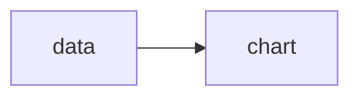

# vizard-line-chart-demo
This is for testing line chart.

## Goal
### mermaid


---

## Overview

**vizard-line-chart-demo** is a web application that allows you to write Markdown with embedded CSV code blocks and instantly preview charts (bar, line) or tables generated from the CSV data. It is built with TypeScript, Vite, D3.js, and markdown-it, and features a modern, maintainable UI.

## Features
- Live Markdown editor and preview (two-panel layout)
- Supports CSV code blocks for chart/table rendering
- Bar chart, line chart, and table visualization
- Customizable chart titles and types via code block info
- Responsive, clean UI (vanilla CSS)

## Getting Started

### Prerequisites
- Node.js (v18 or higher recommended)
- npm

### Installation

```bash
cd markdown-connect
npm install
```

### Development Server

```bash
npm run dev
```

Open http://localhost:5173 in your browser.

## Folder Structure

```
markdown-connect/
├── index.html              # App entry point
├── package.json            # Project metadata and scripts
├── src/
│   ├── main.ts             # App bootstrap & UI logic
│   ├── markdown.ts         # Markdown renderer with CSV chart support
│   ├── parseCSV.ts         # CSV parsing logic
│   ├── renderBarChart.ts   # Bar chart renderer (D3)
│   ├── renderLineChart.ts  # Line chart renderer (D3)
│   ├── renderTable.ts      # Table renderer
│   ├── style.css           # App styles
│   └── views/              # HTML template modules
├── public/                 # Static assets
└── ...
```

## Technology Stack
- [Vite](https://vitejs.dev/) (dev server & build)
- [TypeScript](https://www.typescriptlang.org/)
- [D3.js](https://d3js.org/) (charts)
- [markdown-it](https://github.com/markdown-it/markdown-it) (Markdown parser)

## Usage Example

~~~markdown
```csv title="Sales Data" type="bar"
Month,Sales
Jan,120
Feb,150
Mar,170
```
~~~

- Use `type="bar"`, `type="line"`, or `type="table"` in the CSV code block info to select the visualization.
- The chart/table will be rendered below the code block in the preview panel.

## License
MIT
